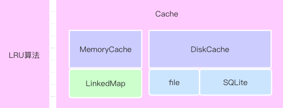

## Cache

### 1. 简介

### 1.1. 描述

**GopherCache** 是一个用于 Swift 语言中缓存库，由**内存缓存**和**磁盘缓存**两部分组成，其中内存缓存提供容量小但高速的存取功能，而磁盘缓存提供大容量但低速的持久化存储，如下图所示：



设计过程中，参考了 [YYCache](https://github.com/ibireme/YYCache), 并对此库的核心代码进行了 Swift 版本的改写以及重新设计，设计 UML 图如下：


具体设计如下：

**1. 泛型协议接口** 
整体接口参照系统 NSCache 类型定义,尽量保持接口统一

**ICacheSynProtocol** ：同步接口
**ICacheAsyProtocol** ： 异步接口

**2. MemoryCache** 

2.1 通过 **MemoryConfig** 配置相关初始化参数

2.2 只遵循了 **ICacheSynProtocol** 同步协议,采用 pthread_mutex_t 自旋锁保证线程安全，其实内部真正缓存类双向列表 **LinkedMap**【遵循 ICacheSynProtocol 协议】

2.3 LinkedMap 配合 Map 实现了 **LRU 淘汰算法**

2.4 内置后台线程**定时自动**清理对象

**3. DiskCache**

2.1 通过 **DiskConfig** 配置相关初始化参数

2.2 遵循了 **ICacheSynProtocol &　ICacheAsyProtocol**　协议，核心通过 **KVStorage** 混合存储 【file & sqlite】实现，data 数据 > 20KB ,二进制数据存储到 file文件中，否则存储到 inlinedata 中

2.3 存储一类对象需要遵循 **DataConvertable** 协议

2.4 内置后台线程**定时自动**清理对象

**4. Cache**

外观层，集成了 DiskCache & MemoryCache，增加了 **CacheAccessOptions** 选项


### 1.2. 特性

* 与内存和磁盘**混合存储**。
* 支持 **线程安全**
* 增加了 **MemoryConfig** 和 **DiskConfig** 配置选项
* 支持 **同步** 和 **异步** API 访问。
* 支持过期 **Expired** 设置
* 采用 **LRU** 算法，在后台线程**自动**清理过期的对象。

-------

### 2. 快速引入

### 2.1. 系统要求

* iOS 8.0+
* Xcode 10.3+
* Swift 5.0+


### 2.2. 手动安装
下载工程，找到工程内 Cache 子文件夹的代码，并将这些源文件添加（拖放）到你的工程中。

### 2.3. CocoaPods
在你工程的 `Podfile` 文件中添加如下一行，并执行 `pod install` 或 `pod update`。

```
pod  待更新
```

-------

### 3. 使用方式

#### 3.1. 基本使用

以**同步缓存字符串**为例：
定义字符串缓存命名空间 CacheStringTest <硬盘缓存文件夹>

``` Swift
let cache = Cache<String>(name:"CacheStringTest")
```

缓存详细配置初始化可调用：

``` Swift
init(memoryConfig:MemoryConfig,diskConfig:DiskConfig)
```
**配置选项，详情见 CacheConfig.swift**

##### 增

``` Swift
cache.setObject("StringValue", forKey: "StringKey")
```
##### 删

删除某一个

``` Swift
cache.removeObject(forKey: "StringKey")
```

删除全部

``` Swift
cache.removeAllObjects()
```

##### 查
``` Swift
let value = cache.object(forKey: "StringKey")
```
##### 是否存在

``` Swift
let flag:Bool = cache.containsObejct(forKey: "StringKey")
```

##### 说明

1. 上述操作函数当中，可通过 access（**默认值为 .default**） 单独设置: .memory 操作 MemoryCahe  或者 设置为 .disk DiskCache
2. 异步操作同理，仅仅区别在函数多 闭包 返回操作, **详情查看 ICacheProtocol.swift 文件**
3. 可以单独使用 MemoryCahe |  DiskCache 相关类进行业务存储

#### 3.2. 自定义类型

自定义类型必须遵守 <**CacheProtocol**:DataConvertable> 协议

目前需要实现以下两个静态方法：

对象转二进制

``` Swift
static func convertToData(_ obj:Self) -> Data?
```

二进制转对象

``` Swift
static func convertFromData(_ data:Data) -> Self?
```

## 致谢

[YYCache](https://github.com/ibireme/YYCache):主要引入了 YYCache 这个库的整体设计思想,其中对 KVStorage 进行了 Swift 版本化翻译，保留了部分源码注释，Cache 上层逻辑进行了 Swift 版本的重构

[SwiftHash](https://github.com/onmyway133/SwiftHash/blob/master/Sources/MD5.swift): 引入了 SwiftHash 的 MD5 模块


